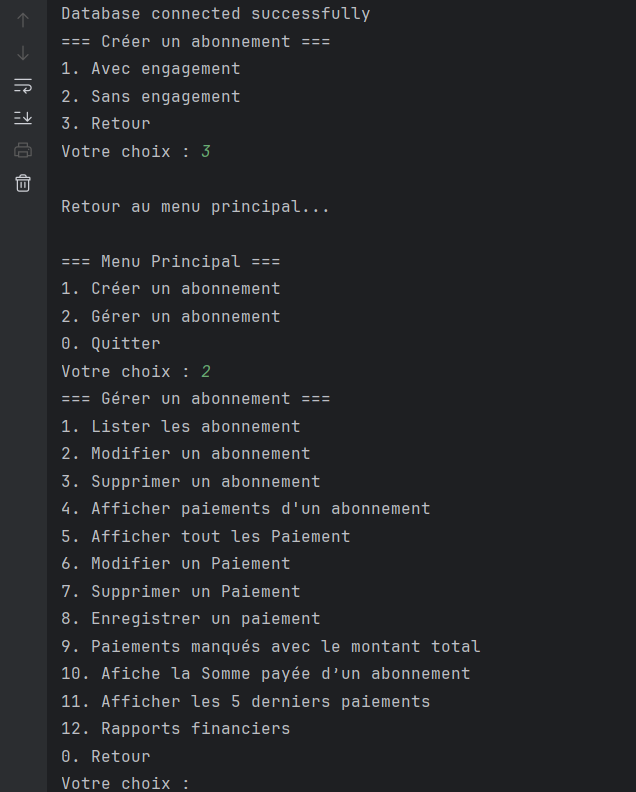
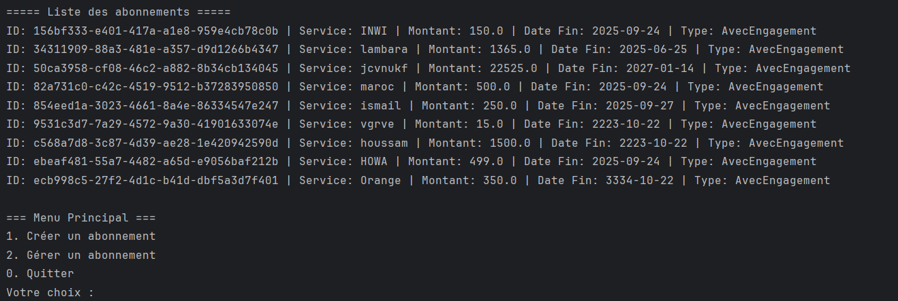
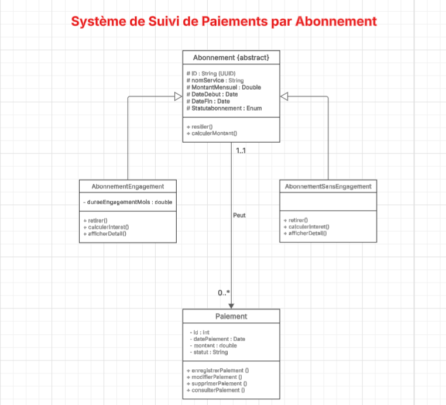

# Gestionnaire d'Abonnements

Ce projet est une application console développée en Java 8 pour centraliser et simplifier la gestion des abonnements personnels et professionnels. Elle permet de suivre les échéances de paiement, de contrôler les dépenses et de générer des rapports financiers clairs.

## Contexte

Dans un monde où les services par abonnement se multiplient (streaming, logiciels, assurances), il devient difficile de garder une vue d'ensemble sur les dépenses et les dates de renouvellement. Cette complexité peut entraîner des paiements manqués ou une mauvaise gestion budgétaire. Ce projet a été créé pour apporter une solution simple et efficace à ce problème.

## Fonctionnalités Principales

L'application offre un menu interactif en console pour effectuer les actions suivantes :

-   **Gestion des Abonnements**
    -   Créer des abonnements avec ou sans engagement.
    -   Modifier les détails d'un abonnement existant.
    -   Supprimer ou résilier un abonnement.
    -   Consulter la liste de tous les abonnements et les filtrer.

-   **Gestion des Paiements**
    -   Enregistrer manuellement un paiement pour une échéance.
    -   Modifier ou supprimer un enregistrement de paiement.
    -   Afficher l'historique des paiements pour un abonnement spécifique.
    -   Consulter la liste des 5 derniers paiements effectués.

-   **Rapports et Suivi Financier**
    -   Générer automatiquement les échéances de paiement futures.
    -   Détecter et lister les paiements en retard ou manqués, avec un calcul du montant total impayé.
    -   Afficher la somme totale déjà payée pour un abonnement.
    -   Produire des rapports financiers synthétiques (dépenses mensuelles, annuelles).

---

## Architecture Technique

Le projet respecte une architecture en couches pour garantir une bonne séparation des responsabilités, une meilleure maintenabilité et une évolutivité simplifiée.

1.  **Couche Présentation (UI)** : Interface utilisateur textuelle (menu en console) servant de point d'entrée pour l'utilisateur.
2.  **Couche Métier (Services)** : Cœur de l'application, elle contient toute la logique applicative (génération d’échéances, détection des impayés, calculs financiers).
3.  **Couche DAO (Data Access Object)** : Couche de persistance qui gère la communication avec la base de données via **JDBC**. Elle abstrait les opérations CRUD (Create, Read, Update, Delete).
4.  **Couche Entité (Entity)** : Représentation des objets métiers sous forme de classes Java (`Abonnement`, `Paiement`).
5.  **Couche Utilitaire** : Fonctions transverses utilisées dans toute l'application (gestion des dates, validations, formatage).

---

## Modèle de Données et Base de Données

### Entités

-   **`Abonnement`** (classe abstraite) :
    -   Attributs : `id` (UUID), `nomService`, `montantMensuel`, `dateDebut`, `dateFin`, `statut` (Enum: `ACTIVE`, `SUSPENDU`, `RESILIE`).
-   **`AbonnementAvecEngagement`** (hérite de `Abonnement`) :
    -   Attribut supplémentaire : `dureeEngagementMois`.
-   **`AbonnementSansEngagement`** (hérite de `Abonnement`).
-   **`Paiement`** :
    -   Attributs : `idPaiement` (UUID), `idAbonnement` (clé étrangère), `dateEcheance`, `datePaiement`, `statut` (Enum: `PAYE`, `NON_PAYE`, `EN_RETARD`).

### Tables de la Base de Données

La persistance est assurée par deux tables principales dans une base de données relationnelle (PostgreSQL ou MySQL).

1.  **Table `Abonnement`**:
    -   `id` (PK), `nomService`, `montantMensuel`, `dateDebut`, `dateFin`, `statut`, `typeAbonnement`, `dureeEngagementMois` (nullable).
2.  **Table `Paiement`**:
    -   `idPaiement` (PK), `idAbonnement` (FK), `dateEcheance`, `datePaiement`, `statut`.

Une relation **un-à-plusieurs** est établie de la table `Abonnement` vers la table `Paiement`.

---

## Exigences Techniques

-   **Langage** : **Java 8**
-   **Paradigmes mis en avant** : Programmation fonctionnelle avec l'**API Stream**, les expressions **lambda**, les `Optional` et les `Collectors`.
-   **Base de Données** : **PostgreSQL** ou **MySQL**.
-   **Connectivité BDD** : **JDBC**.
-   **Gestion des erreurs** : Utilisation de blocs `try/catch` pour une gestion propre des exceptions.
-   **Gestion de version** : **Git**.

## Comment Lancer le Projet

1.  **Prérequis**
    -   JDK 8 ou une version supérieure.
    -   Un SGBD (PostgreSQL ou MySQL) installé et en cours d'exécution.
    -   Git.

2.  **Cloner le Dépôt**
    ```bash
    git clone <URL_DU_DEPOT_GIT>
    cd <NOM_DU_PROJET>
    ```

3   **Exécuter l'Application**
    Lancez l'application à partir du fichier JAR généré ou directement depuis votre IDE.
    ```bash
    java -jar target/nom-du-fichier-1.0.jar
    ```
4   **Photo**





5   **UML**

